# Documentación Hundir la Flota

## Descripción General

Juego clásico de **Hundir la Flota** (Battleship) implementado en Python para consola. El jugador se enfrenta contra la CPU, ambos con tableros de 10x10 y una flota de 5 barcos.

---

## Estructura del Código

### Importaciones
```python
import random  # Para colocación aleatoria de barcos y disparos de la CPU
```

---

## Clases

### 1. Clase `Barco`
Representa un barco individual.

| Atributo | Tipo | Descripción |
|----------|------|-------------|
| `longitud` | int | Tamaño del barco (2-5 celdas) |
| `tocados` | int | Número de impactos recibidos |

| Método | Descripción |
|--------|-------------|
| `__init__(longitud)` | Inicializa el barco con su longitud |
| `esta_hundido()` | Devuelve `True` si tocados == longitud |

> [!NOTE]
> Actualmente la clase `Barco` se crea pero no se rastrea individualmente. El hundimiento se detecta globalmente mediante `hay_barcos()`.

---

### 2. Clase `Tablero`
Gestiona el tablero de juego 10x10.

| Atributo | Tipo | Descripción |
|----------|------|-------------|
| `celdas` | list[list] | Matriz 10x10 del tablero |
| `letras` | list | ["A"-"J"] para traducir coordenadas |

#### Símbolos del Tablero
| Símbolo | Significado |
|---------|-------------|
| `~` | Agua (celda vacía) |
| `B` | Barco |
| `X` | Tocado (impacto) |
| `0` | Agua (disparo fallido) |

#### Métodos

| Método | Parámetros | Descripción |
|--------|------------|-------------|
| `__init__()` | - | Crea tablero 10x10 con agua |
| `colocar_barco()` | barco, fila, columna, orientacion | Coloca un barco en el tablero |
| `es_valido()` | longitud, fila, columna, orientacion | Valida si la posición es correcta |
| `colocar_aleatorio()` | longitud | Coloca un barco en posición aleatoria válida |
| `hay_barcos()` | - | Devuelve `True` si quedan barcos ("B") |
| `disparar()` | fila, columna | Procesa un disparo, devuelve resultado |

---

### 3. Clase `Jugador`
Representa a un jugador (usuario o CPU).

| Atributo | Tipo | Descripción |
|----------|------|-------------|
| `tablero_propio` | Tablero | Donde están sus barcos |
| `tablero_rival` | Tablero | Registro de sus disparos al enemigo |

---

## Función Principal `jugar()`

### Flujo del Juego

```mermaid
flowchart TD
    A[Inicio] --> B[Crear Jugadores]
    B --> C[Colocar Flota: 5,4,3,3,2]
    C --> D{Turno Usuario?}
    D -->|Sí| E[Mostrar tablero disparos]
    E --> F[Pedir coordenadas]
    F --> G[Disparar a CPU]
    G --> H{Victoria?}
    H -->|Sí| I[🏆 VICTORIA]
    H -->|No| J[Cambiar turno]
    D -->|No| K[CPU dispara aleatorio]
    K --> L{Derrota?}
    L -->|Sí| M[☠️ DERROTA]
    L -->|No| J
    J --> D
```



### Composición de la Flota
| Barco | Longitud |
|-------|----------|
| Portaaviones | 5 |
| Acorazado | 4 |
| Crucero | 3 |
| Submarino | 3 |
| Destructor | 2 |

---

## Sistema de Coordenadas

El usuario introduce coordenadas en formato **letra + número** (ej: `A1`, `D5`, `J10`).

```python
fila = usuario.tablero_propio.letras.index(coord[0])  # A=0, B=1...
columna = int(coord[1:]) - 1  # 1=0, 2=1... (ajuste de índice)
```

---

## Resultados de Disparo

| Resultado | Acción | Mensaje |
|-----------|--------|---------|
| `"Tocado"` | Celda = "X" | 🔥 LE HAS DADO / TE HAN DADO |
| `"Agua"` | Celda = "0" | 🌊 AGUA / IA HA FALLADO |
| `"Repetido"` | Sin cambio | Ya habías disparado ahí |

---

## Posibles Mejoras

> [!TIP]
> Mejoras sugeridas para futuras versiones:

1. **Visualización mejorada**: Colores ANSI y formato de tablero con bordes
2. **IA inteligente**: Que busque adyacentes tras un tocado
3. **Colocación manual**: Permitir al usuario colocar sus barcos
4. **Sistema de hundido**: Notificar cuando un barco específico se hunda
5. **Temporizador**: Añadir tiempo de partida
6. **Puntuaciones**: Guardar récords en JSON
7. **Evitar disparos repetidos de CPU**: La CPU puede disparar a la misma celda

---

## Ejecución

```bash
python HundirFlota.py
```

El juego inicia automáticamente al ejecutar el archivo mediante la llamada `jugar()` al final del script.

---

## Resumen de Archivos

| Archivo | Descripción |
|---------|-------------|
| `HundirFlota.py` | Código fuente del juego |
| `DocumentaciónHundirFlota.md` | Este documento |
